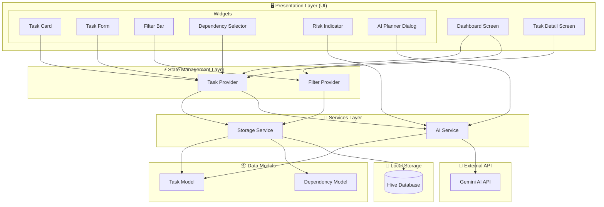
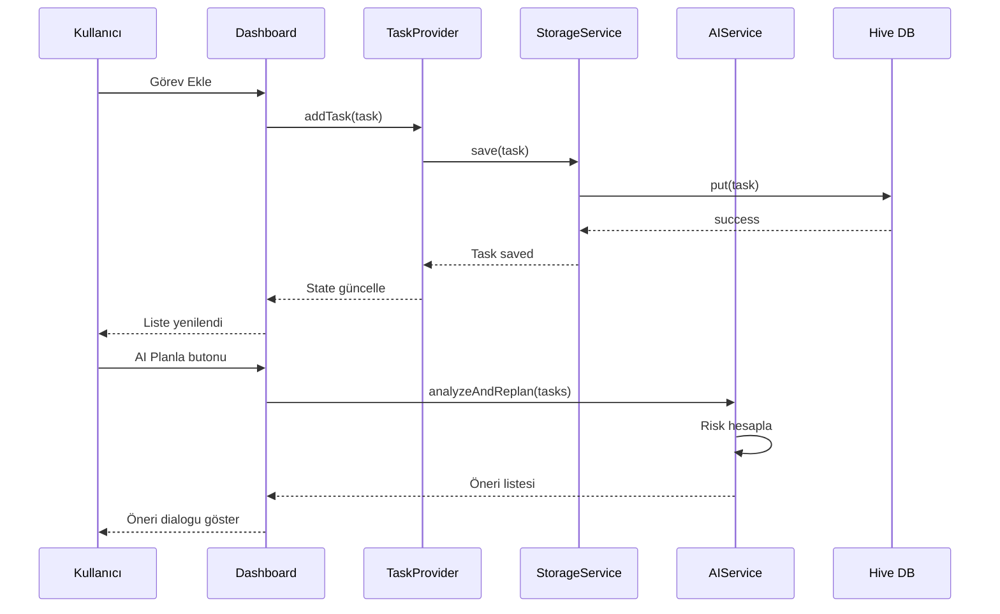

# Smart Task Manager - Component Diagram

## Sistem Bileşen Diyagramı

## Bileşen Açıklamaları

### 🖥️ Presentation Layer (UI)

| Bileşen | Dosya | Açıklama |
|---------|-------|----------|
| Dashboard Screen | `screens/dashboard_screen.dart` | Ana görev listesi ve filtreleme ekranı |
| Task Detail Screen | `screens/task_detail_screen.dart` | Görev detay ve düzenleme ekranı |
| Task Card | `widgets/task_card.dart` | Görev kartı (liste görünümü) |
| Task Form | `widgets/task_form.dart` | Görev ekleme/düzenleme formu |
| Filter Bar | `widgets/filter_bar.dart` | Öncelik ve tarih filtreleme |
| Dependency Selector | `widgets/dependency_selector.dart` | Öncül görev seçici |
| Risk Indicator | `widgets/risk_indicator.dart` | Gecikme riski göstergesi (🔴) |
| AI Planner Dialog | `widgets/ai_planner_dialog.dart` | AI yeniden planlama önerisi |

### ⚡ State Management Layer

| Bileşen | Dosya | Açıklama |
|---------|-------|----------|
| Task Provider | `providers/task_provider.dart` | Görev CRUD ve state yönetimi |
| Filter Provider | `providers/filter_provider.dart` | Filtreleme state yönetimi |

### 🔧 Services Layer

| Bileşen | Dosya | Açıklama |
|---------|-------|----------|
| Storage Service | `services/storage_service.dart` | Hive ile yerel veri saklama |
| AI Service | `services/ai_service.dart` | Gecikme riski analizi ve planlama |

### 📦 Data Models

| Bileşen | Dosya | Açıklama |
|---------|-------|----------|
| Task Model | `models/task_model.dart` | Görev veri yapısı |
| Dependency Model | `models/dependency_model.dart` | Bağımlılık ilişki yapısı |

---

## Veri Akışı

